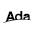

---
layout: default
title: TOP 20 Języków Programowania
---# TOP 20 Języków Programowania wg TIOBE

## 1. Python

- **Pozycja rok temu**: 1
- **Ocena**: 23.85%
- [Więcej informacji](https://www.tiobe.com/tiobe-index/?slug=Python)
- [Zobacz szczegóły](languages/Python)

## 2. C++

- **Pozycja rok temu**: 3
- **Ocena**: 11.08%
- [Więcej informacji](https://www.tiobe.com/tiobe-index/?slug=C%2B%2B)
- [Zobacz szczegóły](languages/C++)

## 3. Java

- **Pozycja rok temu**: 4
- **Ocena**: 10.36%
- [Więcej informacji](https://www.tiobe.com/tiobe-index/?slug=Java)
- [Zobacz szczegóły](languages/Java)

## 4. C

- **Pozycja rok temu**: 2
- **Ocena**: 9.53%
- [Więcej informacji](https://www.tiobe.com/tiobe-index/?slug=C)
- [Zobacz szczegóły](languages/C)

## 5. C#

- **Pozycja rok temu**: 5
- **Ocena**: 4.87%
- [Więcej informacji](https://www.tiobe.com/tiobe-index/?slug=C%23)
- [Zobacz szczegóły](languages/C#)

## 6. JavaScript

- **Pozycja rok temu**: 6
- **Ocena**: 3.46%
- [Więcej informacji](https://www.tiobe.com/tiobe-index/?slug=JavaScript)
- [Zobacz szczegóły](languages/JavaScript)

## 7. Go

- **Pozycja rok temu**: 8
- **Ocena**: 2.78%
- [Więcej informacji](https://www.tiobe.com/tiobe-index/?slug=Go)
- [Zobacz szczegóły](languages/Go)

## 8. SQL

- **Pozycja rok temu**: 7
- **Ocena**: 2.57%
- [Więcej informacji](https://www.tiobe.com/tiobe-index/?slug=SQL)
- [Zobacz szczegóły](languages/SQL)

## 9. Visual Basic

- **Pozycja rok temu**: 10
- **Ocena**: 2.52%
- [Więcej informacji](https://www.tiobe.com/tiobe-index/?slug=Visual%20Basic)
- [Zobacz szczegóły](languages/Visual_Basic)

## 10. Delphi/Object Pascal

- **Pozycja rok temu**: 15
- **Ocena**: 2.15%
- [Więcej informacji](https://www.tiobe.com/tiobe-index/?slug=Delphi/Object%20Pascal)
- [Zobacz szczegóły](languages/DelphiObject_Pascal)

## 11. Fortran

- **Pozycja rok temu**: 14
- **Ocena**: 1.70%
- [Więcej informacji](https://www.tiobe.com/tiobe-index/?slug=Fortran)
- [Zobacz szczegóły](languages/Fortran)

## 12. Scratch

- **Pozycja rok temu**: 9
- **Ocena**: 1.66%
- [Więcej informacji](https://www.tiobe.com/tiobe-index/?slug=Scratch)
- [Zobacz szczegóły](languages/Scratch)

## 13. PHP

- **Pozycja rok temu**: 12
- **Ocena**: 1.48%
- [Więcej informacji](https://www.tiobe.com/tiobe-index/?slug=PHP)
- [Zobacz szczegóły](languages/PHP)

## 14. Rust

- **Pozycja rok temu**: 17
- **Ocena**: 1.23%
- [Więcej informacji](https://www.tiobe.com/tiobe-index/?slug=Rust)
- [Zobacz szczegóły](languages/Rust)

## 15. MATLAB

- **Pozycja rok temu**: 13
- **Ocena**: 0.98%
- [Więcej informacji](https://www.tiobe.com/tiobe-index/?slug=MATLAB)
- [Zobacz szczegóły](languages/MATLAB)

## 16. R

- **Pozycja rok temu**: 21
- **Ocena**: 0.94%
- [Więcej informacji](https://www.tiobe.com/tiobe-index/?slug=R)
- [Zobacz szczegóły](languages/R)

## 17. Assembly language

- **Pozycja rok temu**: 11
- **Ocena**: 0.87%
- [Więcej informacji](https://www.tiobe.com/tiobe-index/?slug=Assembly%20language)
- [Zobacz szczegóły](languages/Assembly_language)

## 18. Ada

- **Pozycja rok temu**: 24
- **Ocena**: 0.85%
- [Więcej informacji](https://www.tiobe.com/tiobe-index/?slug=Ada)
- [Zobacz szczegóły](languages/Ada)

## 19. Kotlin

- **Pozycja rok temu**: 19
- **Ocena**: 0.85%
- [Więcej informacji](https://www.tiobe.com/tiobe-index/?slug=Kotlin)
- [Zobacz szczegóły](languages/Kotlin)

## 20. COBOL

- **Pozycja rok temu**: 20
- **Ocena**: 0.84%
- [Więcej informacji](https://www.tiobe.com/tiobe-index/?slug=COBOL)
- [Zobacz szczegóły](languages/COBOL)

